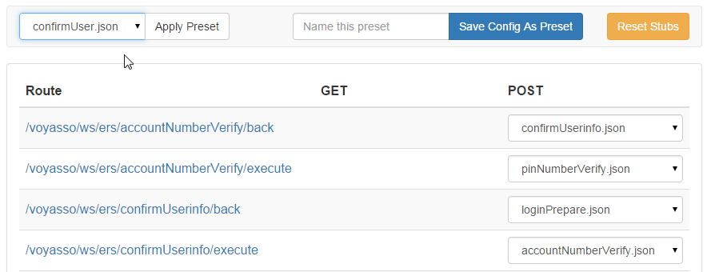

# `voya-stub-server`


DEV NOTE: This package is ES2015/ES2016, it must be compiled before release. `npm run prepublish`.

## Features

   - Allows creation of 'presets', which are saved configurations of active stubs
   - Exposes API for usage with tests
   - Watches stub directory for changes, and always shows the updated stub

## Usage

In your project
```
$ npm install git+ssh://git@github.voya.net:Voya/voya-stub-server.git
```

`voya-stub-server` will automatically create the `/server/local` directory in your project.

### Plain JS

`voya-stub-server` returns a `Promise` when invoked. This promise is resolved when the server has successfully started.

`@param config.port` port number to run on.

`@param config.paths` static paths to serve.

`@param callback` optional, with signature of `(error, server)`, where `server` is an instance of the express server.

```js
var server = require('voya-stub-server');

server({port: 9000, paths: ['.']});
```

### Gulp
```js
var server = require('voya-stub-server');

// dev server
gulp.task('server', function () {
    return server({port: 9000, paths: ['.']});
})

// dist server
gulp.task('server:dist', function () {
    return server({port: 9000, paths: ['./dist']});
});
```

## Using the interface

Navigate to `/services`. Here you will be able to set the active stub for each route.

### Stubs

By default, `voya-stub-server` expects your stubs to be in `/server/local/stubs`.

### Presets

By default, `voya-stub-server` expects your presets to be in `/server/local/presets`.

You can create presets in two ways:

   1. In the interface, set all of the stubs to their desired positions. At the top of the page, enter a name
   for the preset and click 'Save config as preset'. You should now see your preset in the presets dropdown
    
   2. Create a new json file in the presets directory. As soon as the file is added, you should see it in
   the presets dropdown.

### Environment Configurations

By default, `voya-stub-server` expects your environment configurations to be in `/server/local/environments`.

With environment configurations, you can configure proxy server middleware to map local paths to a remote paths.  Here is an example setup.

/server/local/environments/local.json
```
[]
```

/server/local/environments/unit.json
```
[
  {
    "path": "/voyasso",
    "target": "https://my2.unit.voya.com"
  }
]
```

/server/local/environments/some-developers-machine.json
```
[
  {
    "path": "/voyasso",
    "target": "http://wp3werw232:8080"
  }
]
```

## Endpoint documentation

You shouldn't ever need to directly call any of the endpoints -- use the interface instead.
But here is the documentation.

#### `GET /services`

Shows the mock services index

#### `GET /services/setStub`

Sets the default stub for a route

`@param route` the route to configure

`@param stub` the name of the stub to make default

#### `GET /services/setPreset`

Applies a preset. Selects all stubs defined in the preset.

`@param name` the name of the preset to apply

#### `GET /services/reset`

Resets all active stubs to their original values.

#### `POST /services/createPreset`

Creates a preset with the current stub configuration. Saves it in `/server/local/presets`

`@param name` the desired name for this stub
